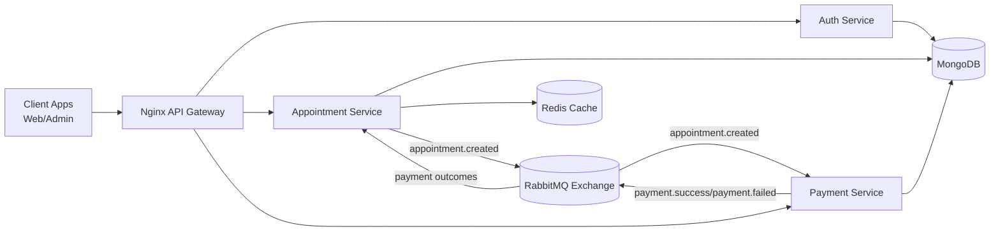

# Smart Queue System

Distributed backend platform for appointment booking with authentication, payment orchestration, Saga-based consistency, and production-oriented deployment primitives (Docker, Kubernetes, CI/CD, observability).

## 1) High-Level Architecture Overview



### Core architecture pattern
- Synchronous HTTP for user-facing APIs via gateway routing.
- Asynchronous event choreography for cross-service workflow.
- Saga compensation to keep eventual consistency across service boundaries.

## 2) System Components Explanation

### API Gateway
- `nginx` routes paths to internal services.
- External entrypoint: `http://localhost:8080` (Docker Compose) or NodePort `30080` (Kubernetes).

### `auth-service`
- JWT-based register/login/profile endpoints.
- Owns user identity and access boundary.
- Exposes `/health` and `/metrics`.

### `appointment-service`
- Books/manages appointments and queue numbers.
- Publishes `appointment.created` after successful booking commit.
- Applies compensation on `payment.failed` by canceling appointment.
- Uses Redis for read-side cache (`appointments:today`, dashboard keys).

### `payment-service`
- Consumes `appointment.created`.
- Simulates gateway payment processing.
- Publishes `payment.success` or `payment.failed`.
- Implements idempotency and event deduplication to prevent duplicate side effects.
- Includes notification simulation listener for event-driven communication.

### Data and Messaging Infrastructure
- MongoDB: durable system of record.
- Redis: cache and low-latency data retrieval support.
- RabbitMQ: asynchronous domain event transport for Saga/event flow.

## 3) Scalability Strategy

- Horizontal scaling through Kubernetes Deployments (`replicas: 2` for core services and gateway).
- Stateless service processes allow independent scaling by load profile.
- Isolated services prevent one domain's traffic spikes from saturating others.
- Queue-driven decoupling protects user API latency from downstream payment timing.
- Resource requests/limits in manifests provide predictable scheduling and isolation.

## 4) Reliability Mechanisms

- Saga compensation:
  - `payment.failed` triggers appointment cancellation workflow.
- Retry strategy:
  - Payment simulation retries with exponential backoff.
  - Message consumers include retry attempts with dead-letter queue fallback.
- Duplicate protection:
  - API idempotency keys for payment endpoint.
  - Event deduplication store (`ProcessedEvent`) for consumed events.
- Failure capture:
  - Failed events persisted for replay/forensics (`FailedEvent`).
- Health-driven resilience:
  - `/health` endpoints + Kubernetes liveness/readiness probes.

## 5) DevOps Pipeline Explanation

GitHub Actions workflow: `.github/workflows/deploy.yml`

Current pipeline on push to `main`:
1. Checkout source.
2. Setup Node.js 20 with npm cache.
3. Install dependencies (`backend` package).
4. Conditionally run tests (only if real test script exists).
5. Build and push Docker image with `latest` and commit-SHA tags.

Operational note:
- Current CI builds a unified backend image (`backend/Dockerfile`).
- Services are deployable independently; next step is per-service image pipelines for tighter release control.

## 6) Kubernetes Deployment Explanation

Kubernetes manifests under `k8s/` include:
- Namespace: `smart-queue`
- Config: `01-configmap.yaml`, `02-secret.yaml`
- Core services:
  - `auth-service.yaml`
  - `appointment-service.yaml`
  - `payment-service.yaml`
  - `nginx.yaml`
- Data stores:
  - `mongo.yaml` (with PVC and health checks)
  - `redis.yaml` (with PVC and probes)
- Composition:
  - `kustomization.yaml`

Deployment flow:
```bash
kubectl apply -k k8s/
kubectl get pods -n smart-queue
kubectl get svc -n smart-queue
```

Kubernetes readiness posture:
- Services are probe-enabled, replicated, and resource-capped.
- External ingress point is Nginx NodePort `30080`.

## 7) Message Queue Event Flow

### Main saga sequence
1. Client books appointment via `appointment-service`.
2. Appointment is committed in MongoDB.
3. `appointment-service` publishes `appointment.created`.
4. `payment-service` consumes `appointment.created`.
5. Payment is processed with retry.
6. `payment-service` publishes:
   - `payment.success`, or
   - `payment.failed`
7. `appointment-service` consumes payment result:
   - on success: logs completion
   - on failure: compensates by cancelling appointment
8. Notification simulation listener logs event reception.

### Event design details
- Correlation IDs (`x-request-id`) are propagated into event metadata.
- Message handlers log step-wise flow for distributed traceability.
- Failed handling retries are explicit and observable in logs.

## 8) Observability Layer Explanation

### Structured logs
- Pino-based JSON logs across services.
- Request context propagation through AsyncLocalStorage.
- Correlation-ready logs for both HTTP and async event paths.

### Metrics
- Prometheus-compatible `/metrics` endpoint per service.
- Includes default process metrics + business counters:
  - `smart_queue_http_requests_total`
  - `smart_queue_failed_payments_total`
  - `smart_queue_payment_retry_attempts_total`
  - `smart_queue_cancelled_appointments_total`

### Health model
- `/health` includes dependency status (Mongo, messaging/cache status where applicable).
- Used by both operators and Kubernetes probes.

## 9) Setup Instructions for Developers

### Prerequisites
- Docker + Docker Compose
- Node.js 20+ (for local-only service runs)
- Git

### Quick start (recommended)
```bash
docker compose up -d --build
```

Verify services:
```bash
docker compose ps
curl http://localhost:8080/api
curl http://localhost:8080/api/pay
```

Run automated flow verification:
```powershell
.\scripts\verify-rabbitmq-flow.ps1
```

This script:
- Builds and starts stack.
- Registers/logs in a test user.
- Books an appointment.
- Tails `appointment-service`, `payment-service`, and `rabbitmq` logs.

### Local service development (without Compose)
Each service has:
```bash
npm install
npm run dev
```

Services:
- `backend/auth-service`
- `backend/appointment-service`
- `backend/payment-service`

## 10) Interview Talking Points

### 30-second pitch
"I built a distributed appointment platform using microservices and event choreography. User-facing calls are synchronous through an API gateway, while cross-service operations run asynchronously via RabbitMQ with Saga compensation for consistency. The system is containerized, Kubernetes-ready, instrumented with structured logs and Prometheus metrics, and hardened with retries, idempotency, and event deduplication."

### Deep-dive points recruiters and panels care about
1. Bounded contexts:
   - Auth, appointment, and payment own separate responsibilities and data interactions.
2. Consistency strategy:
   - Choreographed Saga with compensation instead of distributed transactions.
3. Reliability engineering:
   - Idempotency keys, dedupe store, retry backoff, failed-event persistence, health probes.
4. Operability:
   - Structured logs + request correlation + metrics endpoint for alerting and SLOs.
5. Deployment maturity:
   - Dockerized local parity, Kubernetes manifests, and CI-driven image publishing.
6. Scalability tradeoffs:
   - Stateless services scale horizontally; async queue decouples peak booking traffic from payment throughput.

## Repository Structure

```text
.
|- backend/
|  |- auth-service/
|  |- appointment-service/
|  `- payment-service/
|- docker/
|- docs/
|- k8s/
|- scripts/
|  `- verify-rabbitmq-flow.ps1
`- docker-compose.yml
```

## Roadmap (High-Impact Next Steps)

1. Add per-service CI images and deployment promotion gates.
2. Add automated integration tests for event choreography.
3. Add RabbitMQ Kubernetes manifests for full environment parity.
4. Add OpenTelemetry traces for cross-service latency analysis.
